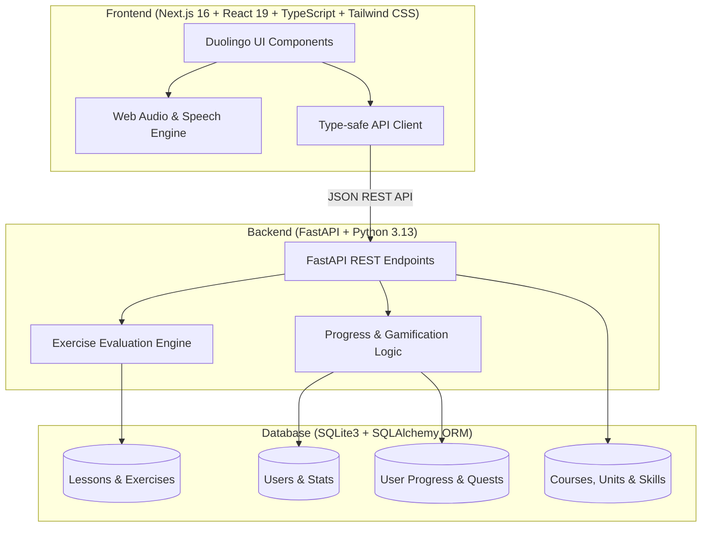
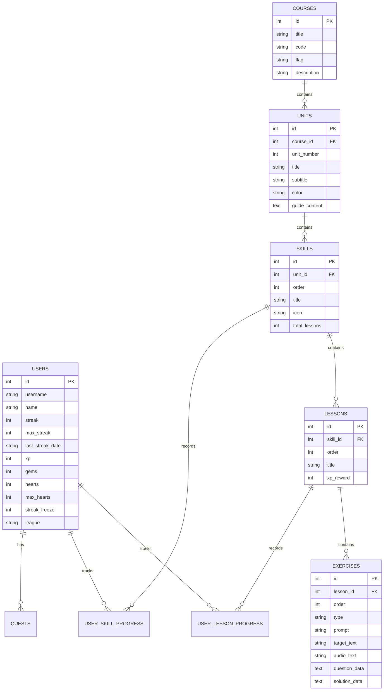

# 🦉 Duolingo Web App Clone - SDE Fullstack Assignment

An authentic, modern, and playful fullstack clone of the **Duolingo** web application. Replicates Duolingo's signature design language, tactile user experience, serpentine learning path, multi-modal exercise lesson loop, and gamification mechanics (daily streaks, hearts, XP, leagues, daily quests, and sound synthesizers).

---

## 🌟 Live Features & Highlights

### 1. 🗺️ Sinuous Learning Path / Skill Tree
- **Serpentine Path:** Sinuous, winding nodes that snake smoothly down the screen.
- **Unit Headers:** Unit banners with custom Duolingo colors (`#58cc02` Green, `#1cb0f6` Blue, `#ce82ff` Purple), titles, subtitles, and interactive **Guidebook** modals with grammar tips and audio pronunciation.
- **Node Progression:** 
  - 🔓 **Unlocked Skills** with crown progress rings and lesson counters.
  - 🔒 **Locked Skills** with padlocks.
  - 👑 **Completed Skills** with gold crowns.
  - 🦉 **Animated Duo Mascot** bouncing directly on the active node with an interactive speech bubble (*"START HERE!"*).
- **Skill Popovers:** Clicking any unlocked skill opens a tactile popover showing lesson progress and a big green `START +15 XP` action button.

### 2. 🎮 Interactive Lesson Player (The Core Loop)
Supports **all 5 signature exercise types**:
1. **Multiple Choice (`multiple_choice`):** Tactile cards with number shortcuts, optional prompt images and target translations.
2. **Translate Words / Word Bank (`translate_words`):** Interactive token selection; tapped words snap into the sentence dropzone, tapping them on the line sends them back to the bank.
3. **Match Pairs (`match_pairs`):** Real-time dual-column card matching (Spanish & English) with green flash on match and red shake on error.
4. **Fill in the Blank (`fill_blank`):** Sentence templates with missing blank slots and multiple choice pill selectors.
5. **Type the Answer (`type_answer`):** Free-text translation with fuzzy normalization, accent tolerance, and a Spanish character helper bar (`á`, `é`, `í`, `ó`, `ú`, `ñ`, `¿`, `¡`).
- **Signature Feedback Drawer:** 
  - Correct: Slide-up `#d7ffb8` drawer with green checkmark, praise (*"Nicely done!"*), and arpeggiated chime.
  - Incorrect: Slide-up `#ffdfe0` drawer with red X, correct solution, explanation, and buzzer sound.
- **Hearts System:** Lose 1 heart on incorrect answers. Reaching 0 hearts triggers the **Out of Hearts** modal with Gem refill, practice session, or quick dev bypass.
- **Celebratory Finish:** Confetti bursts, celebrating Duo mascot, stat badges (XP earned, streak count, accuracy percentage), and crown level-up notifications.

### 3. 🔊 Web Audio API & Web Speech Engine
- Built-in zero-dependency Web Audio API synthesizer for:
  - Cheerful 4-note ascending chime (`playCorrect()`)
  - Low descending error buzz (`playIncorrect()`)
  - Tactile button pop (`playClick()`)
  - Victory fanfare (`playLessonComplete()`)
- Native Web Speech API integration (`speechSynthesis`) that reads Spanish phrases aloud at realistic learner pace on click or hover.

### 4. 🏆 Gamification, Leagues & Quests
- **Streak Counter:** Increments on daily lesson completion, with streak freeze protection and testing day simulation.
- **Weekly Leagues:** Real-time synchronized leaderboard (Bronze, Silver, Gold, Sapphire, etc.) with promotion zones (top 3) and demotion zones.
- **Daily Quests:** Progress bars for XP goals and lesson completions, with one-click gem claim rewards.
- **Shop / Store:** Heart refills, streak freezes, double-or-nothing wagers, and avatar unlocks.
- **Learner Profile:** Statistics grid (streak, total XP, current league, crowns) and multi-tiered achievements (*Wildfire*, *Sage*, *Champion*, *Scholar*).

---

## 🏛️ System Architecture



---

## 🗄️ Database Schema Design



---

## 🚀 Quick Start & Local Execution

### Prerequisites
- **Python 3.10+**
- **Node.js 18+** and **npm**

---

### Step 1: Start the Backend (FastAPI)
```bash
cd backend
python -m pip install -r requirements.txt
python -m uvicorn main:app --host 127.0.0.1 --port 8000 --reload
```
- API will be accessible at: `http://localhost:8000`
- Interactive Swagger UI: `http://localhost:8000/docs`
- *Note:* Database SQLite (`duolingo.db`) is automatically created and seeded on startup.

---

### Step 2: Start the Frontend (Next.js)
In a separate terminal window:
```bash
cd frontend
npm install
npm run dev
```
- Web Application will be live at: `http://localhost:3000`

---

## 🧪 Evaluator & Testing Controls

For immediate verification during interviews and reviews, click the **"Dev & Testing Tools"** button in the bottom left sidebar or top bar:
- **❤️ Lose 1 Heart:** Instantly tests heart deduction and out-of-hearts modal handling.
- **❤️ Refill 5 Hearts:** Immediately replenishes all hearts.
- **🔥 Advance Day:** Simulates day advancement so the next lesson increments the streak counter.
- **🧊 Add Streak Freeze:** Adds streak protection freeze.
- **🔊 Test Audio:** Plays Duolingo's positive chimes and fanfares.
- **🔄 Reset Learner Progress:** Resets completions to the fresh beginning of Unit 1.

---

## 🌐 API Overview

| Method | Endpoint | Description |
| :--- | :--- | :--- |
| `GET` | `/api/users/me` | Fetch active user profile, streak, hearts, and gems |
| `PATCH` | `/api/users/me` | Update user statistics |
| `POST` | `/api/users/refill-hearts` | Replenish hearts via gems or practice |
| `POST` | `/api/users/simulate-streak` | Simulate streak dates and day advancement |
| `POST` | `/api/users/reset-progress` | Reset learner progress back to beginning |
| `GET` | `/api/courses` | List all available language courses |
| `GET` | `/api/courses/{id}/tree` | Get full serpentine unit/skill tree with lock states |
| `GET` | `/api/courses/units/{id}/guidebook` | Retrieve unit guidebook notes and key vocabulary |
| `GET` | `/api/lessons/{id}` | Retrieve lesson with all interactive exercises |
| `POST` | `/api/lessons/exercises/{id}/submit` | Evaluate exercise answer, handle hearts loss |
| `POST` | `/api/lessons/{id}/complete` | Complete lesson, award XP, update streak and unlock next skill |
| `GET` | `/api/leaderboard` | Get weekly league standings with real-time XP sync |
| `GET` | `/api/users/quests` | Retrieve daily quests and progress |
| `POST` | `/api/users/quests/{id}/claim` | Claim gem rewards for completed quests |
| `GET` | `/api/shop` | Retrieve shop inventory items |
| `POST` | `/api/shop/purchase` | Purchase power-ups or outfits with gems |

---

## 🚢 Deployment Guide

- **Frontend (Vercel / Netlify):**
  1. Push repository to GitHub.
  2. Import project into Vercel and select root directory as `frontend`.
  3. Add environment variable: `NEXT_PUBLIC_API_URL=https://your-backend.onrender.com`.
  4. Deploy.
- **Backend (Render / Railway / Fly.io):**
  1. Select root directory as `backend`.
  2. Build command: `pip install -r requirements.txt`.
  3. Start command: `uvicorn main:app --host 0.0.0.0 --port $PORT`.

---

## 📄 License
MIT License. Built for the SDE Fullstack Assignment.
